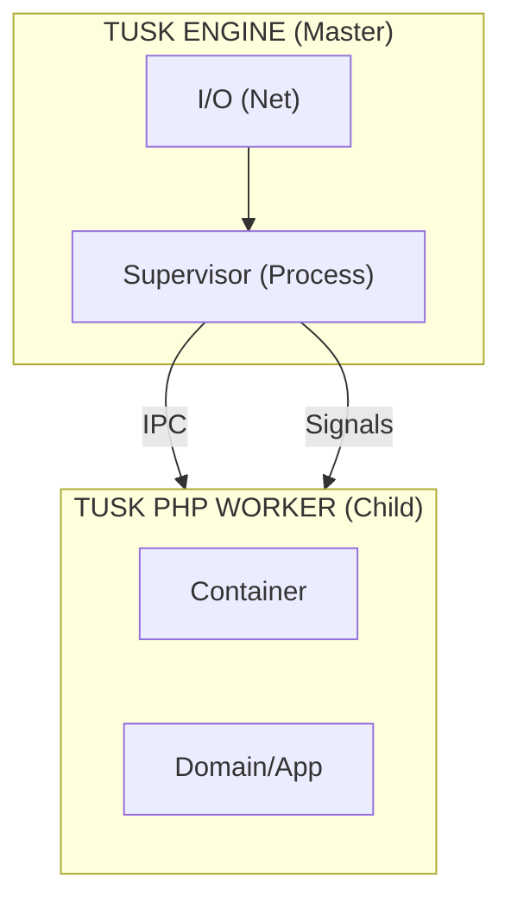

# Tusk Native Engine Specification (Draft)

> **Status:** Visionary Spec v0.1
> **Note:** This component is currently in the **Spec Phase**.

## Overview

The **Tusk Native Engine** is the high-performance backbone of the Tusk Framework. Written in a low-level language (Rust or Go), it serves as the **Master Process** that manages, protects, and feeds work to the persistent PHP Worker processes.

## Core Responsibilities

### 1. Process Supervision (Master)
- **Spawn & Monitor**: Spawns a configured number of PHP workers.
- **Self-Healing**: Automatically restarts PHP workers if they crash or exit due to memory limits.
- **Graceful Orchestration**: Coordinates the startup (`#[OnStart]`) and shutdown (`#[OnShutdown]`) signals across the cluster.

### 2. High-Performance I/O (Adapters)
- **Non-blocking Server**: Handles raw HTTP/1.1, HTTP/2, and HTTP/3 connections.
- **Socket Management**: Manages thousands of concurrent WebSockets.
- **Protocol Translation**: Translates incoming requests into a fast IPC format (e.g., Protobuf or MsgPack) for the PHP workers.

### 3. Inter-Process Communication (IPC)
- **Fast Bridge**: Communication via Unix Sockets, Shared Memory, or high-speed temporary file-pipes.
- **Request/Response Loop**: Forwards incoming work to an idle worker and returns the result to the client.

## Proposed Architecture

## Why Rust/Go?
- **Immutability of the Master Path**: The master process should never crash.
- **Parallelism**: Real multi-threading for the Network stack, while PHP remains single-threaded per worker.
- **Zero-Dependency CLI**: The `tusk` binary is statically compiled and includes the engine.

## Future Integration
The `tusk-engine` will eventually expose APIs for:
- **Hot Reloading** without dropping connections.
- **Shared State** (In-memory key-value store shared across PHP workers).
- **Native Metrics** (Prometheus/OpenTelemetry) gathered directly from the engine.
