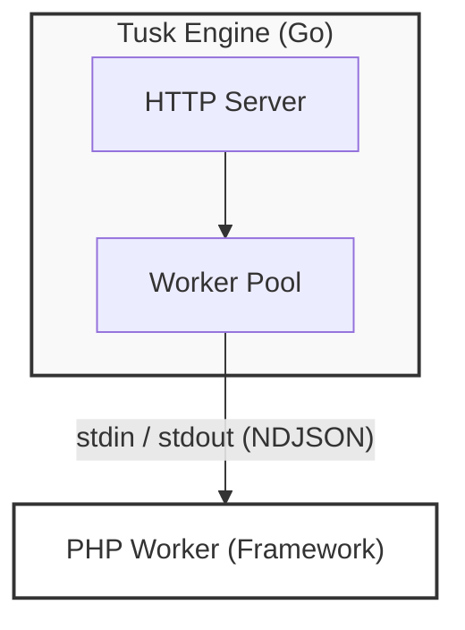
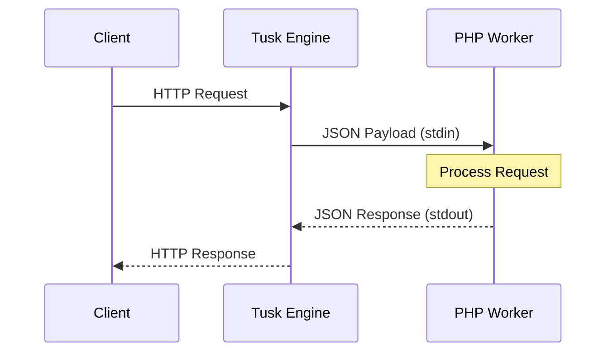

# Tusk Native Engine

The **Tusk Native Engine** is the high-performance application server that powers the Tusk Framework. Built in Go, it replaces the traditional `php-fpm` + `nginx` stack with a single, modern binary.

## Why a Native Engine?

PHP is traditionally single-threaded and relies on a process manager (FPM) and a web server (Nginx/Apache). Tusk Engine consolidates these into one:

- **Performance**: Handles connection pooling, keep-alive, and static files using Go's highly efficient `net/http`.
- **Isolation**: The engine protects the robust server layer from PHP crashes.
- **Portability**: It manages the PHP runtime itself ("Sidecar" mode), meaning you don't even need PHP installed on the host system to run a Tusk app.

## Architecture

The engine uses a Master-Worker architecture:

1.  **Master (Go)**: Accepts incoming HTTP requests.
2.  **IPC (Pipes)**: Forwards the request (Method, Headers, Body) to a PHP worker via Standard I/O (NDJSON).
3.  **Worker (PHP)**: Boots the framework *once* (or reuses state) and processes the request.
4.  **Response**: The worker writes the response JSON back to the Master, which streams it to the client.





## Usage

The `tusk` binary is the single entry point for everything.

### Starting the Server

```bash
tusk start
```
This boots the server on port 8080 (default).

### Framework Commands

The engine also acts as a proxy for your PHP commands. You don't need to run `php console ...`.

```bash
tusk make:controller User
tusk migrate
tusk list
```

## Configuration

Control the engine behavior using `tusk.json` in your project root:

```json
{
    "port": 8080,
    "worker_count": 4,
    "address": "0.0.0.0",
    "php_binary": ".tusk/bin/php", 
    "php_ini": "config/php.ini"
}
```

- **port**: The HTTP port to listen on.
- **worker_count**: How many concurrent PHP processes to maintain.
- **php_binary**: Path to the PHP executable (can be absolute or relative).
